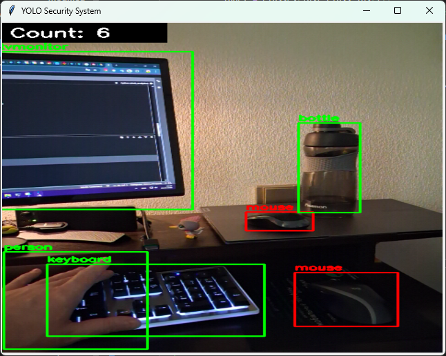

# 🛡️ Computer Vision YOLOv3 

Video Analyzer, Security & Traffic Monitoring - на базі нейромережі **YOLOv3-Tiny**, що дозволяє перетворити будь-яку камеру (або YouTube-трансляцію) на інтелектуальну систему моніторингу. Програма розпізнає об'єкти, рахує їх у реальному часі та сповіщає про появу конкретних цілей, рахувати їх, подавати звуковий сигнал при появі конкретної цілі та вести лог подій.

## 🚀 Основний функціонал
- **Real-time Object Detection:** Виявлення понад 80 типів об'єктів (люди, авто, тварини тощо).
- **Dual Mode:** Робота з локальними/IP-камерами або прямими трансляціями YouTube.
- **Smart Counting:** Лічильник загальної кількості об'єктів у кадрі.
- **Security Logic:** Звуковий сигнал (Beep) та візуальна тривога (ALARM) при виявленні заданого об'єкта (наприклад, `mouse`).
- **Event Logging:** Автоматичний запис усіх спрацювань у файл `detections_log.txt`.
- **Optimization:** Налаштовано для роботи на CPU (без потужної відеокарти) завдяки використанню YOLOv3-Tiny та OpenCL.

---

## 📸 Варіант 1: cv_yolov3tiny_webcam.py з використанням смартфона (IP Webcam)
Проєкт підтримує роботу зі смартфонами через додаток [IP Webcam](https://play.google.com/store/apps/details?id=com.pas.webcam). Це дозволяє використовувати телефон як бездротову камеру безпеки.

## ⚙️ Технічні деталі ##
- Двигун: OpenCV DNN Module.
- Інтерфейс: Tkinter.
- Модель: YOLOv3-Tiny (розмір вхідного зображення 320x320 для швидкості).
- Логування: Текстовий формат з часовими мітками.

## Завантаження файлів моделі ##
Для роботи потрібні конфігураційні файли та ваги (додайте їх у корінь папки):
- yolov3-tiny.weights https://pjreddie.com/media/files/yolov3-tiny.weights
- yolov3-tiny.cfg https://github.com/pjreddie/darknet/blob/master/cfg/yolov3-tiny.cfg
- coco.names  https://github.com/pjreddie/darknet/blob/master/data/coco.names

**Налаштування:**
1. Запустіть сервер у додатку на Android.
2. Запустіть трансляцію в додатку. Ви отримаєте локальну адресу (наприклад, http://192.168.0.164:8080/).
3. Вкажіть цю адресу в коді: adress = "http://192.168.0.164:8080/video".

Скріншот роботи:

  

